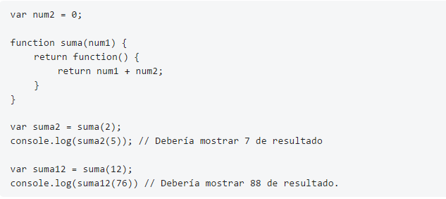

# ejer_leccion20
Modificar el siguiente script usando closures para que se ejecute sin problemas.

Elimino el var num2=0, porque yo quiero que me lea el numero, y además debemos agregar en la función el parámetro num2 y pueda leer la máquina y ejecutará al momento de llamar la función
